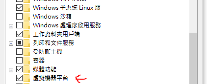
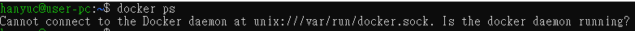

<!-- WSL學習筆記 -->

# WSL 學習筆記

> OpenDate:2024-08-01  
> IDE:Visual Studio Code  
> Code:Markdown  
> Author:柴犬陪唸書

- [1.目前用途](#1)
- [2.基礎安裝](#2)
- [3.實作筆記：Shell Script 開發](#3)
  - [3.1.待補](#3.1)
- [4.實作筆記：Docker 研究](#4)
  - [4.1.WSL2 本機安裝確認無問題](#4.1)
  - [4.2.Ubuntu 如何把 sudo 拿掉](#4.2)
  - [4.3.Visaul Studio Code 如何連線 Docker](#4.3)

# <h2 id="1">1.目前用途</h2>

1. Shell Script 開發
2. Docker 研究

# <h2 id="2">2.基礎安裝</h2>

> 微軟體系提供電腦都是微軟，開發系統沒有虛擬機時，可以先用類 unix 進行開發測試，確認沒問題，可以上 Linux 正式環境。

1. 控制台 -> 開啟或關閉 Windows 功能
2. 適用 Linux 的 Windows 子系統(有些電腦不一樣) 
3. 安裝 WSL 的 Ubuntu，有兩種方法一種是

   1. Microsoft Store -> 搜尋 Ubuntu -> 安裝 -> 電腦重啟
   2. 用 Windows PowerShell 執行

   ```
   wsl --install
   ```

   會安裝 wsl 和默認的 Ubuntu

# <h2 id="3">3.實作筆記：Shell Script 開發</h2>

# <h4 id="3.1">3.1.有用到的指令</h4>

Ubutun 指令介面
更改 root 密碼

```
sudo passwd root
```

`<distroName>` 版本，舉例：wsl --unregister Ubuntu-22.04 解除散發的套件

```
wsl --unregister <distroName>
```

# <h2 id="4">4.實作筆記：Docker 研究</h2>

# <h4 id="4.1">4.1.WSL2 本機安裝確認無問題</h4>

> 原本以為 WSL 安裝完成就可以用下面的方式用 Ubuntu-22.04 的 LTS 指令執行，但會失敗,因為 docker 本身 OS 是使用安裝的電腦作業系統，與 VM 虛擬機不同

> 要先安裝下在 Windows 的 Docker 版本，安裝前要確認電腦作業系統有沒有問題，Windows 虛擬機環境要開啟及 WSL 版本設定成 2 <br>


PowerShell-安裝執行

PowerShell-docker 安裝會需要的版本是 wsl2

```
wsl --set-default-version 2
```

PowerShell-確認最後安裝的版本資訊

```
wsl --version
```

Cmd-也可確認最終安裝的版本資訊

```
wsl --status

wsl --set-version <DistroName> <Version>
```

`<DistroName>`安裝的 WSL 版本，來源參考 status 輸出結果 ex: Ubuntu-22.04<br>
`<Version>`原本裝 1 切換到 2 <br>

> 下載 Windows 版的 Docker 程式，安裝過程中會提醒你說要記得切換到 WSL2。

Ubuntu-在 WSL 中安装 Docker CLI

```
sudo apt-get update
sudo apt-get install -y docker.io
```

Ubuntu-登出重新啟動

```
sudo service docker start
```

cmd-確定本機命令 docker 執行無問題

```
docker --version
docker run hello-world
```

# <h4 id="4.2">4.2.Ubuntu 如何把 sudo 拿掉</h4>

每次如果要執行時，要多打 sudo 會有點麻煩，但直接下指令，又會跳失敗

```
docker ps
```



Ubuntu-檢查 Docker 服務狀態

```
sudo systemctl status docker
```

Ubuntu-檢查 Docker 權限

```
ls -l /var/run/docker.sock
```

> 會有類似這樣的結果<br>
> srw-rw---- 1 root docker 0 Aug 4 15:02 /var/run/docker.sock

先將使用者加入 Docker group

```
sudo usermod -aG docker <username>
newgrp docker
```

`<username>`用登入的帳號

檢查 Docker Daemon 的設定文件 /etc/docker/daemon.json，確保沒有設定錯誤。<br>

Docker Daemon 通常是由 root 用戶運行的，會以 root 用戶的權限來創建和管理 socket。若需要 Docker Daemon 使用其他用戶需設定。<br>

通常這個文件是空的，除非做了其他設定。<br>
可以嘗試將其內容重設為空：

```
sudo sh -c 'echo "{}" > /etc/docker/daemon.json'
```

設定完成後，重啟服務

```
sudo systemctl restart docker
```

確保 Docker Daemon 正在監聽 /var/run/docker.sock，檢查啟動參數是否是確認的 socket

```
ps aux | grep dockerd
```

> -H unix:///var/run/docker.sock 的參數，會出現。

```
docker ps
```

# <h4 id="4.3">4.3.Visaul Studio Code 如何連線 Docker</h4>

1. Remote Development
2. Docker
